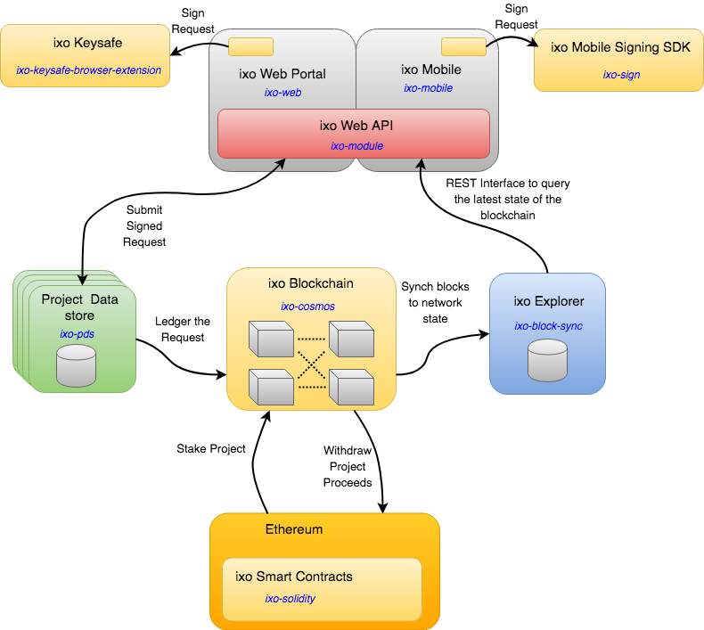

# Documentation

The ixo project is made up of the following key components namely:

- [Web Portal](#web-portal)
- [Keysafe Browser Extension](#keysafe-browser-extension)
- [ixo NPM Module](#ixo-npm-module) 
- [Project Datastore](#project-datastore)
- [ixo Blockchain](#ixo-blockchain)
- [ixo Explorer](#ixo-explorer)
- [Schemas](#schemas) 
- [Documentation](#documentation) 



##Web Portal
 [https://github.com/ixofoundation/ixo-web](https://github.com/ixofoundation/ixo-web)

A reference implementation of the web portal of the ixo protocol
*TODO*

##Keysafe Browser Extension
 [https://github.com/ixofoundation/ixo-keysafe-browser-extension](https://github.com/ixofoundation/ixo-keysafe-browser-extension)

The ixo-keysafe-browser-extension provides signing capabilities for the ixo web frontend. It is fork from the [MetaMask](https://metamask.io/) browser extension, but now uses Sovrin generated DID's as user credentials.

##ixo NPM Module
 [https://github.com/ixofoundation/ixo-module](https://github.com/ixofoundation/ixo-module)

An npm package that wrappers the communication to the ixo backend services and provides usable services to a Javascript application.
*TODO*

##Project Datastore
 [https://github.com/ixofoundation/ixo-pds](https://github.com/ixofoundation/ixo-pds)

A reference implemenation of a project data store. The ixo-pds builds a fully functional docker image to process and store claims and evaluations and then adds a record of these interactoins to the ixo Blockchain

*TODO*

##ixo Blockchain
 [https://github.com/ixofoundation/ixo-cosmos](https://github.com/ixofoundation/ixo-cosmos)

Built on top of Tendermint and using the cosmos SDK, the ixo blockchain records the projects, claims and evaluations that are created through using the ixo-protocol

##ixo Explorer
 [https://github.com/ixofoundation/ixo-block-sync](https://github.com/ixofoundation/ixo-block-sync)

The ixo Explorer provides a set of simple API's to access the publically available project documentation.  It synchronises off the ixo blockchain and stores the current state of projects.

##Schemas 
 [https://github.com/ixofoundation/schem](https://github.com/ixofoundation/schema)

A repository for holding schema templates for the ixo Protocol

### Folder Structure
`/projects` - Project Templates

`/agents` - Agent Templates

`/claims` - Claim Templates

`/evaluations` - Evaluation Templates

### Template Schemas

* The following needs to be updated *

All Templates follow the [JSON-LD](https://developers.google.com/search/docs/guides/intro-structured-data) structure examples can be found at [Schema.org](http://schema.org)

Example:
```
{
  "@context": "http://schema.org",
  "@type": "Organization",
  "url": "http://www.example.com",
  "name": "Unlimited Ball Bearings Corp.",
  "contactPoint": {
    "@type": "ContactPoint",
    "telephone": "+1-401-555-1212",
    "contactType": "Customer service"
  }
}
```

### Templates
Templates describe the labels, input type and the optionality of fields.  These are used on the client side for rendering schemas.

Templates consist of a single data element called `entities` which is an array of the fields/entities that need to be rendered on screen. Each entity has three mandatory values:

`label` - The label for the input

`name` - The name of the input which must be present in the schema and uses dot notation for complex types

`type` - The which describes how the input should be captured

`optional` - Determines whether the entity is required or optional (Defaults to `false`)

`options` - Only used if the type is `select` and contains a list of `labels` and `values`.

`hidden` - If `true` do not display this field.  Defaults to `false`

Example:
```
"options": [
  {
    "label": "Identity Document", 
    "value": "id"
  },
  {
    "label": "Passport",
    "value": "passport"
  }
]
```

#### Template Types
`text` - Renders a text input

`textarea` - Renders a multiline text input

`country` - Renders a selection box containing a list of country names and returns the (ISO 3166-2)[https://en.wikipedia.org/wiki/ISO_3166-1_alpha-2]

`select` - Generic selection box containing a list of options.  If this type is selected the `option` value must also be set.

`image` - Renders an image or allows one to be uploaded

##Documentation
 [https://github.com/ixofoundation/mkdocs](https://github.com/ixofoundation/mkdocs)

The repository contains the documentaion for the ixo system and is build using mkdocs.  It builds the content for this site.


