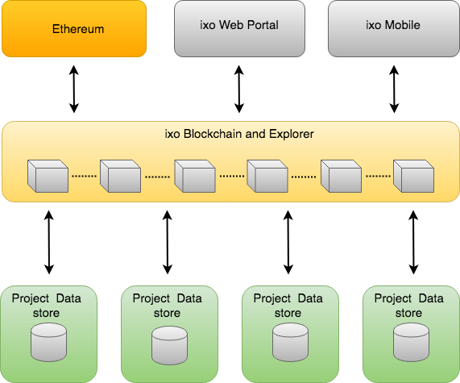
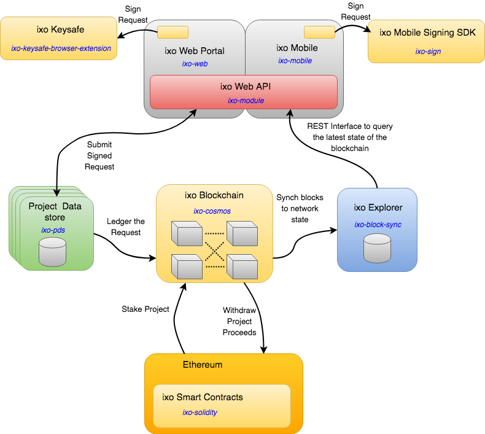

# Welcome to the ixo Protocol
Please have a look at the [ixo Foundation website](http://ixo.foundation) for more information on what we do.

#Introduction
The documentation on this site is aimed at technical people who wish to understand the inner workings of the ixo protocol, how it works and how to integrate your applications and systems into the protocol.

In simple terms, the ixo protocol allows for the creating of projects in persuit of the UN's sustainable development goals. People, systems or IOT devices can then submit claims regarding 
the work performed against these projects.  This work is then evaluated for accuracy and authenticity by evaluators.  Evaluators may also be people, systems or evaluation oracles that could pull in vast amounts of data to determine the evaluation result.

#Overview of the Architecture
The ixo platform is managed by a number of components and systems that interoperate in order to provide the full services that the ixo protocol offers.

For futher information see the [documentation on our components](./documentation/).

##The ixo Blockchain
The ixo blockchain contains the records of evey claim that is issued against a project the the subsequent evaluation of those claims.  Each record is validated by a quorum of validator nodes before it is written to the chain and thereafter the record cannot be removed or updated.  This data is then aggegated to build out the final states of the projects.

All the information on the ixo blockchain is publically avaialble through the ixo Explorer. This data includes the project information, stats regarding the project, the stakeholders of the project and the structure of data being captured against the project.  All actual claim data is stored in the Project Datastore.

##Privacy of Data
Much of the data that is captured within a claim is highly sensive in nature.  This data might have specific regulator requirements such as GDPR or maybe the data may not reside outside certain geographical boundaries.  In order to comply with this and to also put the data into the hands of the owners of the project we have created the concept of independant data stores for each project.

The ixo Blockchain keeps a link to the location of these project data stores and provides services to the project data that are goverened by cryptographic access controls.

##Security
All requests to that create data or access sensitive data require cryptographic signatures and a capabilities model supports this to provide finer grained access control.

## Message Flows

### Update Messages
In general update requests are created and signed on the front end using our keysafe which holds the private keys for the user. The request with it's signature portion is then passed to the Project Datastore (PDS) when it is processed and the results is then ledgered onto the ixo blockchain with hash references back to the original transaction on the PDS. The block containin the request is then processed on the ixo blockchange and the ixo Explorer the sychs this block to the current system state.

### Read Messages
When reading publically availably data a REST call is made to the ixo Explorer that contians the current state of the the blockchain.  If provate information needs ot be accessed than a signed request is submitted to the PDS which will respond withthe data if the the signature and capabilited of the user adhere to the policies for that data.

# Pilots
## Amply
Amply is a MVP project that we have built to prove the utility of the ixo protocol.  The code for this project can be found on our [Amply github repository](https://github.com/TrustlabTech).  

